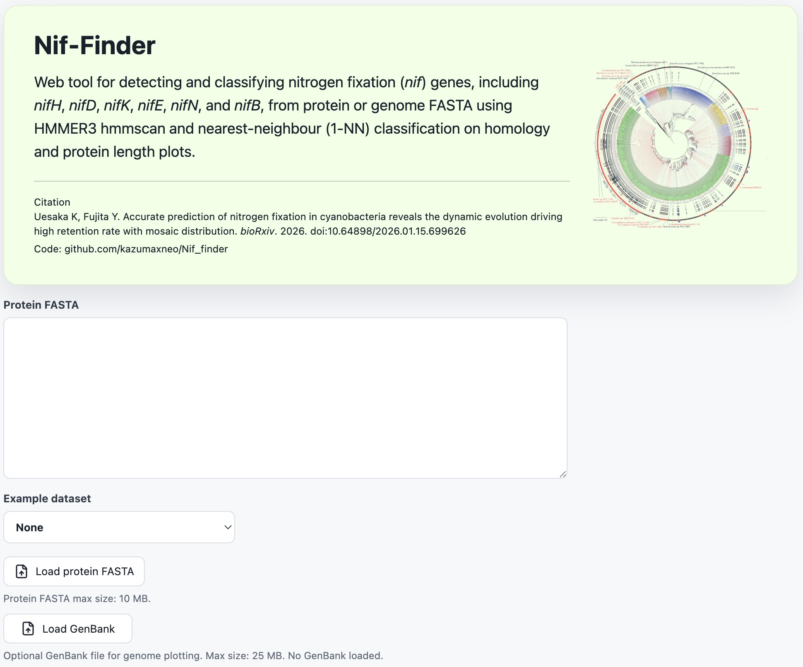
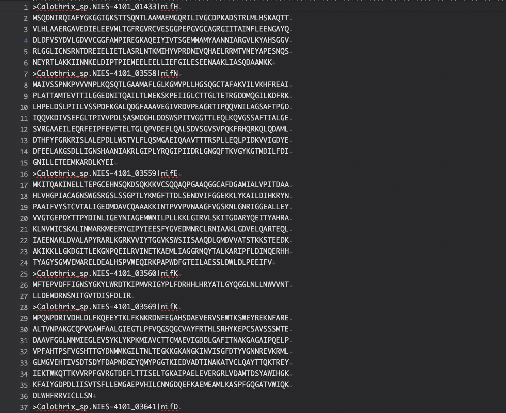
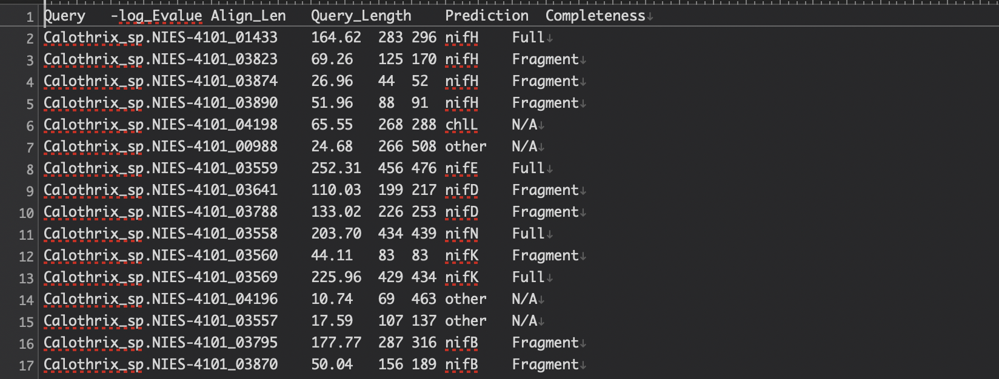

# Nif_finder

A command-line tool for detecting and classifying nitrogen fixation (*nif*) genes:  **nifH**, **nifD**, **nifK**, **nifE**, **nifN**, and **nifB** from protein fasgta or genome fasta using HMMscan and nearest-neighbour (1-NN) classification on homology and protein length plot.


## Requirements

- Python ≥ 3.8
- [HMMER](http://hmmer.org/) (`hmmscan` must be in `$PATH`)
- Python packages: `biopython`, `numpy`, `matplotlib` (matplotlib required only for `--plot`)

## Install
```bash
#dependency
mamba create -n Nif_Finder python=3.10 -y
conda activate Nif_Finder
pip install biopython numpy matplotlib
mamba install -c bioconda -y hmmer

#Nif_Finder
git clone https://github.com/kazumaxneo/Nif_finder.git
cd Nif_finder/generl_bacteria/
export NIF_FINDER_DB="$(pwd)"
python Nif_finderv0_24.py -h
```

`NIF_FINDER_DB` should point to the directory containing the bundled model
folders (`nifH`, `nifD`, `nifK`, `nifE`, `nifN`, and `nifB`). When this
environment variable is set, Nif-Finder can automatically load the standard
HMM profiles and reference classification files.


## Test run

### Single protein FASTA (`-q`)

```bash
cd Nif_finder/generl_bacteria/
python Nif_finderv0_24.py \
  -q protein_test/Calothrix_sp.NIES-4101.faa \
  -p -s
```

To run independent HMM profile scans in parallel without changing the HMM
profiles, E-value threshold, classification logic, or plot contents, add
`--jobs`. For example, `--cpu 12 --jobs 6` runs up to six profile scans at the
same time and divides the CPU budget across them.

For a faster protein FASTA test run, use profile-level parallelism:

```bash
python Nif_finderv0_24.py \
  -q protein_test/Calothrix_sp.NIES-4101.faa \
  -o Calothrix_fast_test \
  --jobs 3 --cpu 6 \
  -p -s
```

See [Memory usage](#memory-usage) for the measured peak memory of this example.

To extract the matching nif-encoding region from a GenBank file, provide the
full GenBank file with `--genbank`:

```bash
python Nif_finderv0_24.py \
  -q ../web/public/examples/leptolyngbya_boryana_dg5.faa \
  --genbank ../web/public/examples/leptolyngbya_boryana_dg5.gbk \
  --context_size_kb 10 \
  -o Leptolyngbya_nif
```

This writes `Leptolyngbya_nif_nif_encoding_region.gbk`, an annotated GenBank
file containing the local nif-cluster region. It also writes
`Leptolyngbya_nif_genome_overview.svg` and
`Leptolyngbya_nif_local_context.svg` to show the detected nif positions on the
genome and in the enlarged local region. The extracted region uses the same
left-edge +1 coordinate convention as the web pinpoint view.

For many `.faa` files, `--jobs` and `--cpu` only speed up each individual
input file. To use many cores efficiently across many files, run one Nif-Finder
process per file with GNU parallel. On a 16-core machine, start with 16
single-file processes and keep each HMMscan lightweight:

```bash
input_dir=.
mkdir -p results
find "$input_dir" -maxdepth 1 -name "*.faa" | parallel -j 16 '
  base=$(basename {} .faa)
  python Nif_finderv0_24.py -q {} -o results/${base} --jobs 1 --cpu 1 -s -p
'
```

### Genome DNA FASTA (`-g`)

Performs 6-frame translation internally, then runs HMMscan on the translated ORFs. Useful for detecting *nif* genes on scaffolds that may carry intervening sequences or rearrangement junctions. Note: takes longer time for 6 frame homology search.

```bash
python Nif_finderv0_24.py \
  -g genome_test/Calothrix_sp.NIES-4101.fna \
  --min_orf_len 30 -p -s
```

If you need to use a custom model set, you can still specify `-t/--profile` and
`-r/--reference` manually. Manual paths take precedence over `NIF_FINDER_DB`.


---

## Options

| Option | Default | Description |
|--------|---------|-------------|
| `-q`, `--query` | — | Path to a single protein FASTA file |
| `-d`, `--query_dir` | — | Path to a directory containing `.faa` files |
| `-g`, `--genome` | — | Path to a genome DNA FASTA file (6-frame translation mode) |
| `-t`, `--profile` | `NIF_FINDER_DB` standard models | HMM profile file(s); one per gene, space-separated |
| `-r`, `--reference` | `NIF_FINDER_DB` standard references | Reference TSV file(s); one per gene, same order as `-t` |
| `-o`, `--outprefix` | input filename | Output file prefix |
| `-m`, `--matrix_output` | `nif_matrix.tsv` | Gene-status matrix output file (directory mode only) |
| `--genbank` | — | GenBank file used to extract an annotated nif-encoding local region (`-q` or `-g` mode) |
| `--genbank_dir` | — | Directory containing GenBank files matching `.faa` basenames (`-d` mode) |
| `--context_size_kb` | `10` | Flanking region size used for GenBank local-context extraction, 1–30 kb |
| `-s`, `--save_fasta` | off | Save detected NifHDKENB sequences to FASTA |
| `-p`, `--plot` | off | Save scatter plot PNG (protein length vs. −log₁₀ E-value) |
| `-c`, `--cpu` | `8` | Number of CPU threads for HMMscan |
| `-j`, `--jobs` | `1` | Number of independent HMM profile scans to run in parallel. `1` preserves the previous sequential behavior |
| `-e`, `--evalue` | `1e-10` | HMMscan E-value threshold. The default is recommended unless you have a specific reason to change sensitivity |
| `--min_orf_len` | `10` | Minimum ORF length (aa) retained after 6-frame translation (`-g` only) |

*`-q`, `-d`, and `-g` are mutually exclusive.*
*If `-t`/`-r` are omitted, set `NIF_FINDER_DB` to the bundled database directory.*

## Memory usage

On the bundled `protein_test/Calothrix_sp.NIES-4101.faa` example, peak memory
usage was about 65 MiB without `-p` and about 135–140 MiB with scatter plotting
enabled. Running `--jobs 3 --cpu 6` reduced runtime while keeping peak memory
similar for this protein FASTA test.

## Web interface

Nif-Finder can also be used from the public web interface:  
https://web-theta-black-17.vercel.app/

<p align="center">
  <a href="https://web-theta-black-17.vercel.app/"></a>
</p>


The web UI runs on Vercel and sends protein FASTA jobs to a Hugging Face Spaces
(Docker compute API) to run Python/HMMER. If no one use for a while, the image may become inactive, so it can take a little time to wake up on the free compute level.

The `web/` directory contains a Vercel-ready side project for submitting protein
FASTA sequences and visualizing Nif-Finder-compatible results. 

The `compute/` directory contains a Docker/FastAPI service that runs the
Python/HMMER tool for the web interface. Deploy it separately and set
`NIF_FINDER_API_URL` in Vercel to the compute service `/analyze` endpoint.
For Hugging Face Docker Spaces, use the repository root Dockerfile and set
`NIF_FINDER_API_URL` to `https://<space-name>.hf.space/analyze`. If
`NIF_FINDER_API_KEY` is configured on the compute service, set the same secret in
Vercel so the web app can authenticate compute requests.

---

## Output files

### Summary table (`<prefix>.txt`)

Tab-separated table written for each query.

| Column | Description |
|--------|-------------|
| `Query` | Sequence ID |
| `-log_Evalue` | −log₁₀(E-value) of the best HMMscan hit |
| `Align_Len` | Alignment length of the hit (aa) |
| `Query_Length` | Full length of the query protein (aa) |
| `Prediction` | Predicted gene identity (`nifH/D/K/E/N/B`, `other`, `unclassifiable`, …) |
| `Completeness` | `Full`, `Fragment`, `Full_operon`, or `N/A` |

### Gene-status matrix (`-d`)

In directory mode, `nif_matrix.tsv` reports all detected statuses per gene. If a genome contains both a full-length copy and fragmented copies of the same gene, the matrix keeps both, for example `Full+Fragment`.


### Nif FASTA sequnece (`-s`)

`<prefix>_nifHDKENB.faa` — protein sequences of all detected *nif* hits, with gene prediction appended to each sequence ID (`>seqid|nifH`, etc.).

### Nif-encoding GenBank region (`--genbank`)

`<prefix>_nif_encoding_region.gbk` — local GenBank region containing detected
*nif* hits and neighbouring ORFs. Nif-Finder adds qualifiers such as
`/nif_finder_gene`, `/nif_finder_status`, and `/nif_finder_query` to matched
CDS features. This file can be used for nif-cluster comparison tools such as
clinker.

`<prefix>_genome_overview.svg` and `<prefix>_local_context.svg` are also
written when `--genbank` or `--genbank_dir` is used. These SVG files show the
whole-genome nif positions and the enlarged local context around matched CDS
features.

### Scatter plot (`-p`)

`<prefix>_scatter.png` — 6-panel figure (one panel per gene). Each panel shows:

- Reference data: *nif*-class hits (light gene colour) and other hits (grey)
- Query hits colour-coded by gene, with marker shapes indicating status:
  - `●` Full
  - `▲` Fragment
  - `★` Full_operon
  - `◆` unclassifiable
- Dashed vertical line: alignment length threshold for Full/Fragment classification (reference scale)

---

## Classification logic

### 1-NN classification

Each HMMscan hit is classified by finding the nearest reference point in z-score-normalised (alignment length, −log₁₀ E-value) space. If the nearest-neighbour distance exceeds `NN_DISTANCE_THRESHOLD` (default: `2.0`), the hit is labelled **unclassifiable** rather than assigned to any gene or "other" class. This prevents paralogue cross-hits (e.g. nifEN operons mis-hitting the nifDK reference cluster) from receiving a spurious gene label.

### Full / Fragment

A hit predicted as a *nif* gene is `Full` if its alignment length meets the per-gene threshold, and `Fragment` otherwise.

| Gene | Alignment length threshold (aa) |
|------|--------------------------------|
| nifH | 240 |
| nifD | 370 |
| nifK | 410 |
| nifE | 400 |
| nifN | 400 |
| nifB | 370 |

### nif operon detection

A query is classified as `nif operon` when **two or more distinct *nif* genes** are detected on the same sequence (e.g. a scaffold encoding both nifE and nifN), each satisfying both:

1. Alignment length ≥ gene threshold
2. −log₁₀(E-value) ≥ `nif_median_loge × OPERON_EVALUE_FRACTION` (default: `0.5`)

---

# Test Run Result: *Calothrix* sp. NIES-4101

**[Complete Genome Sequence of the Heterocystous Cyanobacterium *Calothrix* sp. NIES-4101](https://doi.org/10.1093/pcp/pcae011)**  
Kazuma Uesaka & Mari Banba et al., *Plant and Cell Physiology*, 2024. DOI: [10.1093/pcp/pcae011](https://doi.org/10.1093/pcp/pcae011)

The vegetative cell genome of  *Calothrix* sp. NIES-4101 encodes 13 highly fragmented *nifHDKB* segments and complete *nifEN* genes (upper). These fragmented *nif* genes are reconstructed in the heterocyst to express functional nitrogenase (lower).

<p align="center"></p>

---

## Nif-Finder Prediction Results

### Detection Summary
Nif-Finder was used to identify and annotate highly fragmented nif genes in the NIES-4101 genome.

3 files are created.
<p align="center"></p>  

1. Calothrix_sp.NIES-4101_nifHDKENB.faa (predicted nifHDKENB sequence: when -s flag was set)
<p align="center"></p>
2. Calothrix_sp.NIES-4101_results.txt (-log E-value and related information of all predicted nif homologue sequence)
<p align="center"></p>
3. Calothrix_sp.NIES-4101_results_scatter.png (when -p flag was set)
<p align="center"></p>

### *nifH* Fragment Analysis
*Calothrix* sp. NIES-4101 encodes two copies of the *nifH* gene:
- **nifH2**: A complete/intact copy (full-length; encoded in a genomic region that differs by 2.0 Mb in length from other nif genes).
- **nifH1**: A fragmented copy split into 4 parts (reconstructed in heterocyst cell).

Nif-Finder successfully detected the full-length *nifH2* and 3 out of 4 *nifH1* fragments based on the alignment threshold (240 aa).

<p align="center"></p>
## Version history

| Version | Changes |
|---------|---------|
| v0.21 | z-score normalisation for 1-NN; Full_operon detection redesigned as post-processing; scatter plot added |
| v0.22 | `-g` genome DNA mode with internal 6-frame translation; `--min_orf_len` option |
| v0.23 | Bug fix
| v0.24 | `NIF_FINDER_DB` environment variable support for automatic standard model/reference discovery |

---

## Citation

Uesaka K, Fujita Y. Accurate prediction of nitrogen fixation in cyanobacteria
reveals the dynamic evolution driving high retention rate with mosaic
distribution. *bioRxiv*. Posted January 15, 2026. DOI:
[10.64898/2026.01.15.699626](https://doi.org/10.64898/2026.01.15.699626)

---

## License

MIT License
