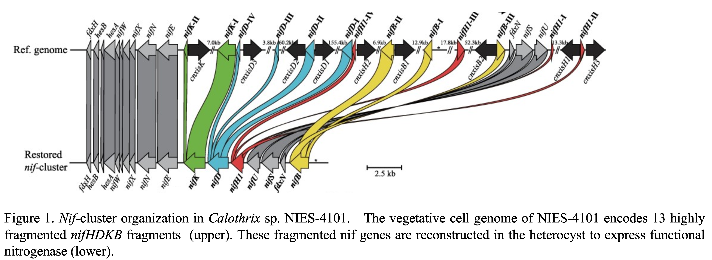
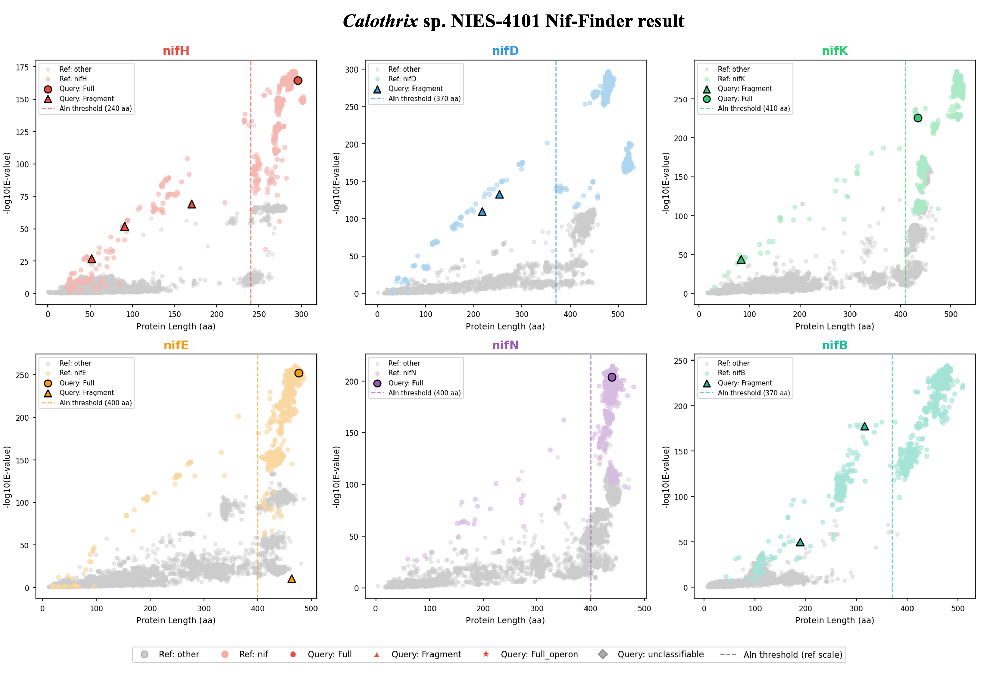
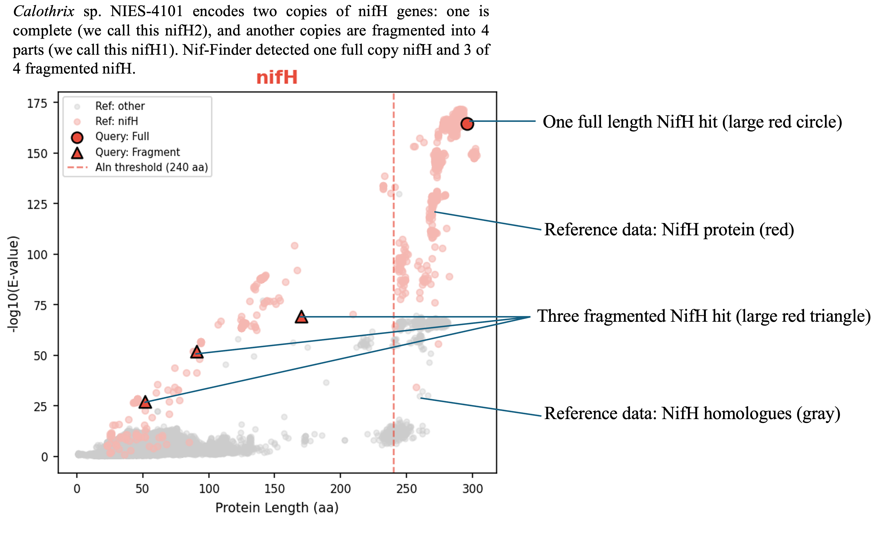

# Nif_finder

A command-line tool for detecting and classifying nitrogen fixation (*nif*) genes:  **nifH**, **nifD**, **nifK**, **nifE**, **nifN**, and **nifB** from protein fasgta or genome fasta using HMMscan and nearest-neighbour (1-NN) classification on homology and protein length plot.


## Requirements

- Python ≥ 3.8
- [HMMER](http://hmmer.org/) (`hmmscan` must be in `$PATH`)
- Python packages: `biopython`, `numpy`, `matplotlib` (matplotlib required only for `--plot`)

## Install
```bash
#dependency
mamba create -n Nif_Finder python=3.10 -y
conda activate Nif_Finder
pip install biopython numpy matplotlib
mamba install -c bioconda -y hmmer

#Nif_Finder
git clone https://github.com/kazumaxneo/Nif_finder.git
cd Nif_finder/generl_bacteria/
python Nif_finderv0_23.py -h
```


## Test run

### Single protein FASTA (`-q`)

```bash
cd Nif_finder/generl_bacteria/
python Nif_finderv0_23.py \
  -q protein_test/Calothrix_sp.NIES-4101.faa \
  -t nifH/proteins_hmm nifD/proteins_hmm nifK/proteins_hmm \
     nifE/proteins_hmm nifN/proteins_hmm nifB/proteins_hmm \
  -r nifH/nifHclassification nifD/nifDclassification nifK/nifKclassification \
     nifE/nifEclassification nifN/nifNclassification nifB/nifBclassification \
  -p -s
```

### Genome DNA FASTA (`-g`)

Performs 6-frame translation internally, then runs HMMscan on the translated ORFs. Useful for detecting *nif* genes on scaffolds that may carry intervening sequences or rearrangement junctions. Note: takes longer time for 6 frame homology search.

```bash
python Nif_finderv0_23.py \
  -g genome_test/Calothrix_sp.NIES-4101.fna \
  -t nifH/proteins_hmm nifD/proteins_hmm nifK/proteins_hmm \
     nifE/proteins_hmm nifN/proteins_hmm nifB/proteins_hmm \
  -r nifH/nifHclassification nifD/nifDclassification nifK/nifKclassification \
     nifE/nifEclassification nifN/nifNclassification nifB/nifBclassification \
  --min_orf_len 30 -p -s
```


---

## Options

| Option | Default | Description |
|--------|---------|-------------|
| `-q`, `--query` | — | Path to a single protein FASTA file |
| `-d`, `--query_dir` | — | Path to a directory containing `.faa` files |
| `-g`, `--genome` | — | Path to a genome DNA FASTA file (6-frame translation mode) |
| `-t`, `--profile` | required | HMM profile file(s); one per gene, space-separated |
| `-r`, `--reference` | required | Reference TSV file(s); one per gene, same order as `-t` |
| `-o`, `--outprefix` | input filename | Output file prefix |
| `-m`, `--matrix_output` | `nif_matrix.tsv` | Gene-status matrix output file (directory mode only) |
| `-s`, `--save_fasta` | off | Save detected NifHDKENB sequences to FASTA |
| `-p`, `--plot` | off | Save scatter plot PNG (protein length vs. −log₁₀ E-value) |
| `-c`, `--cpu` | `8` | Number of CPU threads for HMMscan |
| `--min_orf_len` | `10` | Minimum ORF length (aa) retained after 6-frame translation (`-g` only) |

*`-q`, `-d`, and `-g` are mutually exclusive.*

---

## Output files

### Summary table (`<prefix>.txt`)

Tab-separated table written for each query.

| Column | Description |
|--------|-------------|
| `Query` | Sequence ID |
| `-log_Evalue` | −log₁₀(E-value) of the best HMMscan hit |
| `Align_Len` | Alignment length of the hit (aa) |
| `Query_Length` | Full length of the query protein (aa) |
| `Prediction` | Predicted gene identity (`nifH/D/K/E/N/B`, `other`, `unclassifiable`, …) |
| `Completeness` | `Full`, `Fragment`, `Full_operon`, or `N/A` |


### Nif FASTA sequnece (`-s`)

`<prefix>_nifHDKENB.faa` — protein sequences of all detected *nif* hits, with gene prediction appended to each sequence ID (`>seqid|nifH`, etc.).

### Scatter plot (`-p`)

`<prefix>_scatter.png` — 6-panel figure (one panel per gene). Each panel shows:

- Reference data: *nif*-class hits (light gene colour) and other hits (grey)
- Query hits colour-coded by gene, with marker shapes indicating status:
  - `●` Full
  - `▲` Fragment
  - `★` Full_operon
  - `◆` unclassifiable
- Dashed vertical line: alignment length threshold for Full/Fragment classification (reference scale)

---

## Classification logic

### 1-NN classification

Each HMMscan hit is classified by finding the nearest reference point in z-score-normalised (alignment length, −log₁₀ E-value) space. If the nearest-neighbour distance exceeds `NN_DISTANCE_THRESHOLD` (default: `2.0`), the hit is labelled **unclassifiable** rather than assigned to any gene or "other" class. This prevents paralogue cross-hits (e.g. nifEN operons mis-hitting the nifDK reference cluster) from receiving a spurious gene label.

### Full / Fragment

A hit predicted as a *nif* gene is `Full` if its alignment length meets the per-gene threshold, and `Fragment` otherwise.

| Gene | Alignment length threshold (aa) |
|------|--------------------------------|
| nifH | 240 |
| nifD | 370 |
| nifK | 410 |
| nifE | 400 |
| nifN | 400 |
| nifB | 370 |

### nif operon detection

A query is classified as `nif operon` when **two or more distinct *nif* genes** are detected on the same sequence (e.g. a scaffold encoding both nifE and nifN), each satisfying both:

1. Alignment length ≥ gene threshold
2. −log₁₀(E-value) ≥ `nif_median_loge × OPERON_EVALUE_FRACTION` (default: `0.5`)

---

## Test run result
<p align="center"></p>
azuma Uesaka & Mari Banba et al, 2024
Complete Genome Sequence of the Heterocystous Cyanobacterium Calothrix sp. NIES-4101
Plant and Cell Physiology, 2024. DOI: 10.1093/pcp/pcae011

<p align="center"></p>

<p align="center"></p>

## Version history

| Version | Changes |
|---------|---------|
| v0.21 | z-score normalisation for 1-NN; Full_operon detection redesigned as post-processing; scatter plot added |
| v0.22 | `-g` genome DNA mode with internal 6-frame translation; `--min_orf_len` option |
| v0.23 | Bug fix

---

## License

MIT License
